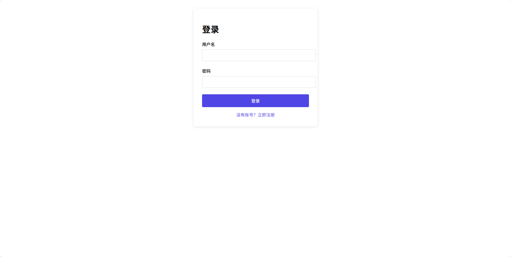
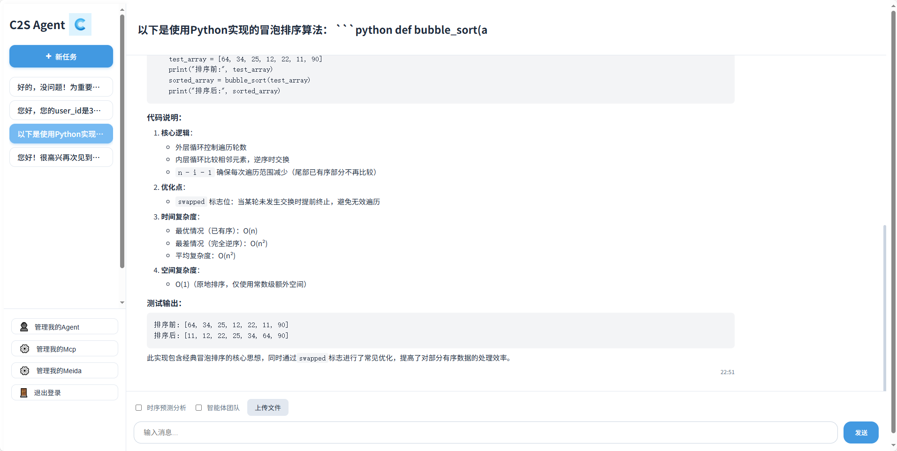
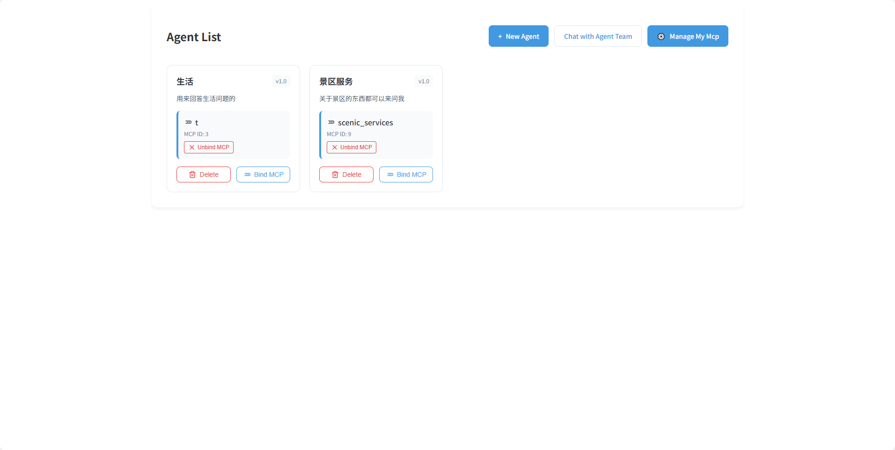
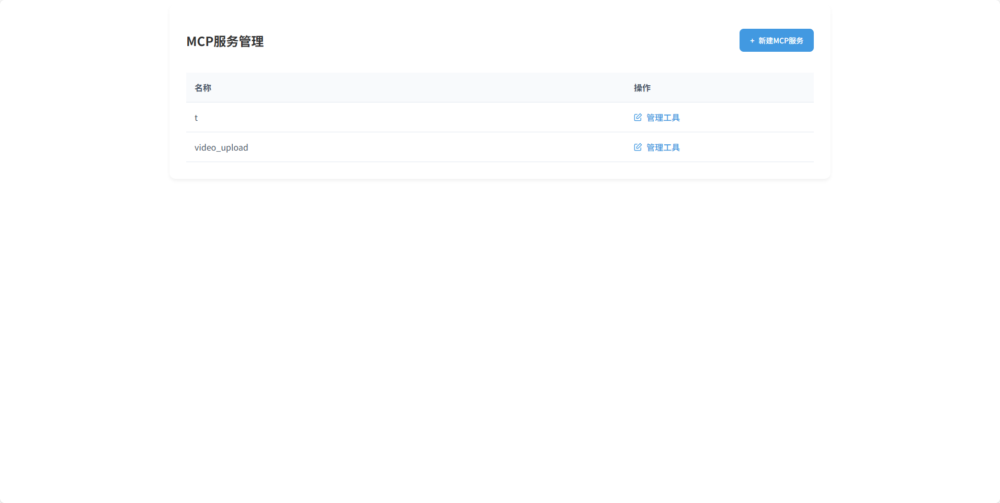

<div align="center">

<a href="http://www.c2sagent.com/"></a>

# C2S Agent

C2S Agent 是一个AI Agent构建平台，提供在线可配置的Agent，MCP服务，这意味只要你有一个HTTP请求的接口，就可以把他配置成为一个MCP工具，同时Agent之间可以进行自交流，像一个团队解决您的问题

</div>

## 🛸 在线使用

- [www.c2sagent.com](http://www.c2sagent.com/)

|                                    |                                    |
| ---------------------------------- | ---------------------------------- |
|  |  |
|  |  |

## 💡 功能描述

`1` 可配置Agent
   - 您只需要为Agent配置一个llm_url和api_key，和一段详细的描述
   - 可以为您的Agent绑定一个MCP服务

`2` 可配置MCP服务
   - 您只需要新建一个MCP服务，即可在下面以HTTP请求接口的形式配置MCP工具
   - 创建完成后，即可在Agent中绑定该MCP服务

`3` 时序分析功能
   - 您只需要上传带头的CSV文件，给一段你想要的描述，即可进行预测和分析
   - 他会返回预测的数据和图片


## 👨‍💻 开发

项目技术栈：Python + MongoDB + PostgreSQL

- **⚡ 快速部署**

  > 使用 Docker-compose 快速启动后端项目
  ```bash
  git clone https://github.com/C2SAgent/c2sagent.git
  cd c2sagent/docker
  docker-compose up --build -d
  ```

  > 使用 Docker-compose 快速启动前端项目
  ```bash
  cd vue-frontend
  docker-compose up -d
  ```

  > 在启动前端项目时，需要在nginx.conf文件中添加你的域名，或者改为你的本机地址

- **🚀 快速开发**

  > 启动后端项目
  ```bash
  git clone https://github.com/C2SAgent/c2sagent.git
  uv venv .venv
  uv sync
  python main.py
  python main_a2a.py
  python main_mcp.py
  ```


## 🏘️ 加入我们

我们正在寻找志同道合的小伙伴，加速 C2S Agent 的发展。
联系邮箱：chen_zailong@qq.com


## 🤝 参与贡献

我们非常欢迎各种形式的贡献。如果你对贡献代码感兴趣，可以查看我们的 GitHub [Issues](https://github.com/C2SAgent/c2sagent/issues)。

## 使用协议

本仓库完全开源，用于学习交流，商用存在风险
