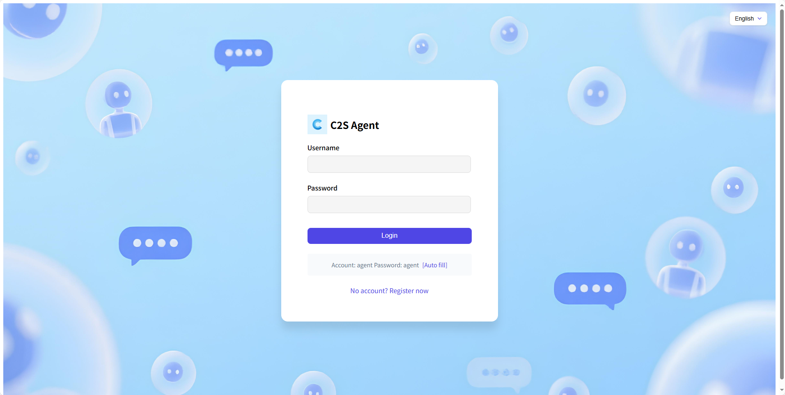
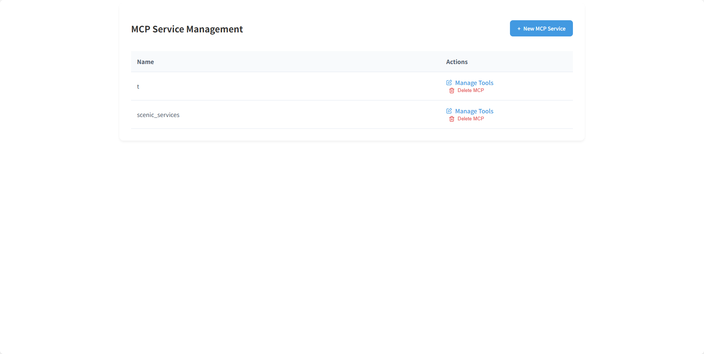

# C2S Agent

C2S Agent is an AI Agent construction platform that provides configurable online Agents and MCP services. This means that as long as you have an HTTP request interface, you can configure it into an MCP tool. Additionally, Agents can communicate with each other, working as a team to solve your problems.

English | [简体中文](./README_zh.md)

## 🛸 Online Access

- [www.c2sagent.com](http://www.c2sagent.com/)

|                                    |                                    |
| ---------------------------------- | ---------------------------------- |
|  |  |
|  |  |

## 💡 Features

1 Configurable Agents
   • You only need to configure an llm_url, api_key, and a detailed description for your Agent.

   • You can bind an MCP service to your Agent.

2 Configurable MCP Services
   • You just need to create a new MCP service and configure MCP tools in the form of HTTP request interfaces.

   • Once created, you can bind the MCP service to your Agent.

## 💡 Some Solutions (Continuously Optimizing)

1 Single-Port Multi-Agent Service Based on A2A Protocol
   • https://github.com/C2SAgent/c2sagent/blob/main/src_a2a/a2a_server/__init__.py extends the functionality of the A2A protocol. If needed, you can modify it for your project.

   • You can use it to implement multiple A2A services on a single port by simply passing an agent_index.

2 Single-Port HTTP Multi-MCP Service Based on MCP Protocol
   • https://github.com/C2SAgent/c2sagent/blob/main/src_mcp/mcp_server/server/mcp_server.py extends the functionality of the MCP protocol. If needed, you can modify it for your project.

   • You can use it to implement multiple MCP services on a single port by simply passing an mcp_server_id to access the service.

## 👨💻 Development

Core Tech Stack: Python + MongoDB + PostgreSQL
AI Tech Stack: A2A + MCP

- **⚡ Quick Deployment**

  > Use Docker-compose to quickly launch the backend project:
  git clone https://github.com/C2SAgent/c2sagent.git
  cd c2sagent/docker
  docker-compose up --build -d

  > Use Docker-compose to quickly launch the frontend project:
  cd vue-frontend
  docker-compose up -d

  > When launching the frontend project, you need to add your domain or local address to the nginx.conf file.

- **🚀 Quick Development**

  > Install PostgreSQL

  > Install MongoDB

  > Launch the backend project:
  git clone https://github.com/C2SAgent/c2sagent.git
  uv venv .venv
  uv sync
  ./start_service.sh start

  > Launch the frontend project:
  cd vue-frontend
  npm install
  npm run dev

## 🏘️ Join Us

We are looking for like-minded collaborators to accelerate the development of C2S Agent.
Contact email: chen_zailong@qq.com

## 🤝 Contribute

We welcome contributions in all forms. If you're interested in contributing code, check out our GitHub https://github.com/C2SAgent/c2sagent/issues.
